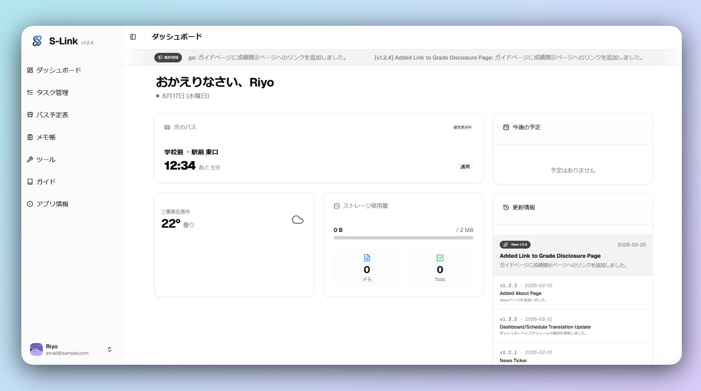

<div align="center">

# S-Link

**学校内PBLプロジェクト — 学生向け学校生活支援Webアプリ**

時間割・課題・バス時刻・天気など、学生が日常的に確認する情報を1つの画面に集約したWebアプリケーションです。
本リポジトリは学校内の授業プロジェクト（PBL）の成果物として公開しています。

> 学校固有のデータ（時間割・シラバス・教員情報など）はプライバシー上の理由からリポジトリに含まれていません。

<br>



</div>

---

## 課題と解決プロセス

生徒・教員双方の課題をヒアリングし、課題発見・設計・実装・UX改善のサイクルで解消しました。

<br>

### 生徒の課題

#### バス時刻の即時確認と臨時バス対応

**課題発見** — バスの路線は把握しているが、次の便まであと何分かをすぐ確認できる手段がなかった。また臨時バスの時刻は基本的に知らされず、乗れるか分からない状況だった。

| | |
|:--|:--|
| **設計** | 通常時刻表をJSONで管理するサーバーレス構成とし、教員から入手した臨時バスの時刻表も同じ構造で追加できる設計にした。 |
| **実装** | `setInterval` で毎秒再描画し、残り時間を4段階で色分け。残り1分を切るとパルスアニメーション付きの赤色警告に変化。当日の終バス後は翌日の始発へ自動切替。 |
| **UX改善** | 出発後も数分間カードを表示し続けることで、乗り遅れた直後に次の選択肢がすぐ分かる体験を設計。通常便と臨時便を同一UIで統一表示した。 |

<br>

### 教員・教室の検索

**課題発見** — 教員の所在・連絡先は掲示板や冊子に分散しており、急いで探せる手段がなかった。また新入生は棟・階・部屋番号の体系が分からず、教室を探し回るケースが頻発していた。

| | |
|:--|:--|
| **設計** | 教員情報・教室情報をそれぞれJSONで管理。検索はサーバーへの通信なしにクライアント側で完結させ、入力のたびに即座に絞り込まれる体験を目指した。 |
| **実装** | 教員検索は `useMemo` で名前・メールアドレス・居室番号を横断する部分一致フィルタを実装。教室検索は棟→階→室の3層階層JSONを1つのキーワードで絞り込む構造にした。 |
| **UX改善** | 教員カードにはオフィスアワー（曜日・時間）を並記し、「いつ・どこへ行けばいいか」を1画面で把握できるようにした。教室名は数字のみの部屋番号に「号室」を自動付加し、建物名は辞書で日本語表示に変換。 |

<br>

### 手続き・リンクの一元化

**課題発見** — 公欠届・寮手続き・成績確認など各種フォームが異なるURLに散在しており、毎回検索し直す手間が発生していた。さらにGoogleフォームは学校用アカウントでの提出が必要なため、アカウント切替の手順を知らない生徒もいた。

| | |
|:--|:--|
| **設計** | 手続きリンクをカテゴリ別にまとめたガイドページと、Googleフォーム提出に必要なアカウント切替をアシストするツールページを別途設けることにした。 |
| **実装** | リンク集はJSONドリブンで管理し、辞書ファイルと分離することで言語設定に関わらず同一コードで動作する構造とした。 |
| **UX改善** | 「ガイド」「ツール」で機能を分割し、目的に応じて迷わずたどり着けるナビゲーション設計にした。ツールページはカード型UIで各機能を視覚的に選びやすくした。 |

<br>

#### 時間割のWeb表示

**課題発見** — 時間割はPDF配布のみで、スマートフォンから今日の授業をすぐ確認できなかった。

| | |
|:--|:--|
| **設計** | 時間割データをJSONに変換し、学年・クラス・曜日でフィルタリングできる構造にした。 |
| **実装** | 現在コマをリアルタイムでハイライト（"NOW"バッジ）。休講・振替情報を行事データと連動させ、振替日の曜日変更を自動反映。 |
| **UX改善** | 今日の授業を開いた瞬間に把握できるよう、当日の時間割を最初に表示する設計とした。 |

<br>

#### 行事予定のWeb表示

**課題発見** — 行事予定もPDF配布のみで、「今日から直近1ヶ月に何があるか」を素早く把握できなかった。テスト期間や学校行事の見落としが起きていた。

| | |
|:--|:--|
| **設計** | 行事データを学期・月別のJSONに分割して管理。4月始まりの学年暦を考慮した独自ソート順（4〜3月）で学期タブを構成した。 |
| **実装** | `Promise.all` で当月・翌月のデータを並列フェッチし初期表示を高速化。ダッシュボードには今日以降の直近5件を自動抽出してウィジェット表示する。 |
| **UX改善** | 月別カレンダーに行事詳細ダイアログを実装し、日付タップで詳細確認できるインタラクションを追加。ダッシュボードから直接確認できる動線も設けた。 |

<br>

### 教員の課題

#### 生徒へのシラバス周知

**課題発見** — 教員から「生徒がシラバスを読まない」という課題提示があった。PDFとして配布されているだけでは授業前に参照される機会が少なかった。

| | |
|:--|:--|
| **設計** | 生徒が毎日開く時間割の各コマにシラバスを紐づけ、授業をタップすると「第N週の内容」が展開する設計にした。シラバスを別途探しに行かなくても自然に目に入る導線を作った。 |
| **実装** | 週番号はサーバーサイドで学期開始日から算出し、休講・振替日を自動補正するアルゴリズムを実装。シラバスダイアログを開くと現在週へ自動スクロールする。 |
| **UX改善** | 週次計画が未設定の科目ではシラバスPDFへのリンクにフォールバックするデュアル対応とし、教員側が段階的に移行できるようにした。 |

---

## 技術スタック

| レイヤー | 技術 |
| --- | --- |
| フレームワーク | Next.js 16 (App Router) |
| 言語 | TypeScript 5 |
| UI | React 19, Tailwind CSS 4, Shadcn/UI |
| 認証 | NextAuth + Google OAuth（`@ktc.ac.jp` ドメイン制限） |
| データベース | Supabase (PostgreSQL) |
| アニメーション | Framer Motion, Lottie |
| デプロイ | Vercel / PWA (Web App Manifest) |

---

## 主な実装機能

| 機能 | 概要 |
| --- | --- |
| ダッシュボード | 次のバス・天気・直近行事・ストレージ使用量ウィジェット、ニュースティッカー |
| バス時刻表 | 秒単位カウントダウン、路線別表示、寮生向け優先路線自動選択 |
| 時間割 | 学年・クラス別フィルタ、現在コマハイライト、シラバス週次リンク |
| 行事予定表 | 学期別・月別カレンダー、行事詳細ダイアログ |
| Todo 管理 | ネスト構造のサブタスク、完了カスケード、Supabase クラウド同期 |
| メモ帳 | Markdown プレビュー、自動保存、クラウド同期 |
| ツール | 教員検索、教室検索、Google フォームアカウント切替 |
| ガイド | 学校手続き・制度情報の横断検索 |
| 設定 | テーマ・フォント切替、19 言語対応（即時切替） |

---

## セットアップ

```bash
npm install
```

プロジェクトルートに `.env.local` を作成し、以下の環境変数を設定してください。

```env
NEXT_PUBLIC_SUPABASE_URL=
SUPABASE_SECRET_KEY=
GOOGLE_ID=
GOOGLE_SECRET=
NEXTAUTH_SECRET=
NEXTAUTH_URL=
```

```bash
npm run dev   # 開発サーバー起動 → http://localhost:3000
npm run build # 本番ビルド
```

---

## Contributors

<div align="center">

[@riyoway](https://github.com/riyoway) · [@kamezawa](https://github.com/kamezawa) · [@koseiokuda](https://github.com/koseiokuda) · [@takutaku6514](https://github.com/takutaku6514)

</div>

---

<div align="center">

This project is licensed under the terms specified in the [LICENSE](./LICENSE) file.

</div>
